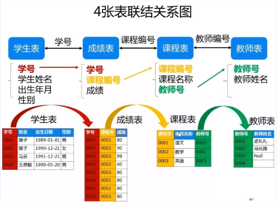

# Mysql基本语法练习
>  题目来源 : [SQL 50题](https://zhuanlan.zhihu.com/p/43289968)

## 表结构简介

* Student(s_id, s_name, s_birth, s_sex) // 学生编号、 学生姓名、 学生生日、 学生性别
* Course(c_id, c_name, t_id)            // 课程编号、 课程名称、 教师编号
* Teacher(t_id, t_name)                // 教师编号、 教师姓名
* Score(s_id, c_id, s_score)           // 学生编号、 课程编号、 分数



##  1.查询课程编号为“01”的课程比“02”的课程成绩高的所有学生的学号（重点）

    思路：
        1. 需要一张表 NewTable(s_id, c_id1_score, c_id2_score)
        2. 找出c_id = 01的学生 select s_id, s_score from score where c_id = '01' 
        3. 找出c_id = 02的学生 select s_id, s_score from score where c_id = '02'
        4. 两张表连接，用学生的编号来关联 inner join on student t1.s_id = t2.s_id
        5. 第四步得到的NewTable, 查询where t1.s_score > t2.s_score 得到新的表
        6. 再把新表和Student关联引入s_name, inner join Student on s_id

```
select id_t.s_id, s_name from
(
select t1.s_id from
(
(select s_id, s_score as s1 from score where c_id = '01') as t1
inner join
(select s_id, s_score as s2 from score where c_id = '02') as t2
on 
t1.s_id = t2.s_id) where s1 > s2) as id_t
inner join Student  as name_t
on name_t.s_id = id_t.s_id;
```
        +------+--------+                                                                                                                                            
        | s_id | s_name |                                                                                                                                            
        +------+--------+                                                                                                                                            
        | 02   | 钱电   |                                                                                                                                            
        | 04   | 李云   |                                                                                                                                            
        +------+--------+ 

## 2. 查询平均成绩大于60分的学生的学号和平均成绩（简单，第二道重点）
    
    思路：
        1. 对Score表group by s_id.
        2. 对每组的s_score 求avg

```
select s_id, avg(s_score) as avg_score
    from score
group by s_id having avg(s_score) > 60;
```
        +------+-----------+                                                                                                                                         
        | s_id | avg_score |                                                                                                                                         
        +------+-----------+                                                                                                                                         
        | 01   |   89.6667 |                                                                                                                                         
        | 02   |   70.0000 |                                                                                                                                         
        | 03   |   80.0000 |                                                                                                                                         
        | 05   |   81.5000 |                                                                                                                                         
        | 07   |   93.5000 |                                                                                                                                         
        +------+-----------+ 

***group by 通常和聚合函数一起使用***

***having 用在group之后的筛选， where用在group之前***

## 3. 查询所有学生的学号、姓名、选课数、总成绩（不重要）
        思路：
                1. 把student表和score表关联起来.
                2. 通过group by s_id 对学生分组， 求出每组的科目数count, 总成绩 sum
        
```
select st.s_id as id, st.s_name as name, count(sc.c_id) as count, sum(case when sc.s_score is NULL then 0 else sc.s_score end) as sum
from
(
        student as st
        left join
        score as sc
        using(s_id)
) group by 
s_id;

```
        +----+------+-------+------+                                                                                                                                 
        | id | name | count | sum  |                                                                                                                                 
        +----+------+-------+------+                                                                                                                                 
        | 01 | 赵雷 |     3 |  269 |                                                                                                                                 
        | 02 | 钱电 |     3 |  210 |                                                                                                                                 
        | 03 | 孙风 |     3 |  240 |                                                                                                                                 
        | 04 | 李云 |     3 |  100 |                                                                                                                                 
        | 05 | 周梅 |     2 |  163 |                                                                                                                                 
        | 06 | 吴兰 |     2 |   65 |                                                                                                                                 
        | 07 | 郑竹 |     2 |  187 |                                                                                                                                 
        | 08 | 王菊 |     0 |    0 |                                                                                                                                 
        +----+------+-------+------+ 

***通过case when 过滤一些特殊的情况如NULL***

## 4. 查询姓“猴”的老师的个数（不重要）
        思路：
                1. 在teacher表中用 t_name like '猴%'
                2. count(t_id)

```
select count(t_id) as teacher猴
from teacher
where t_name like '猴%'
```

        +-----------+                                                                                                                                                
        | teacher猴 |                                                                                                                                                
        +-----------+                                                                                                                                                
        |         0 |                                                                                                                                                
        +-----------+  

***like 用法模糊查找 %表示任意字符***

## 5. 查询没学过“张三”老师课的学生的学号、姓名（重点）

        思路：
                1. 先把teacher表和course表关联起来 using(t_id)
                2. 逆向思维找出学过张三老师课的 where t_name = '张三'
                3. 使用not in


```
select  st.s_id, st.s_name
from student as st
where st.s_id not in
(
        select so.s_id
        from score as so
        where so.c_id in
        (select co.c_id
        from 
        (
                course as co
                inner join 
                teacher as te
                using(t_id)
        )
        where te.t_name = '张三') 
)
```
        +------+--------+                                                                                                                                            
        | s_id | s_name |                                                                                                                                            
        +------+--------+                                                                                                                                            
        | 06   | 吴兰   |                                                                                                                                            
        | 08   | 王菊   |                                                                                                                                            
        +------+--------+  

***使用了in 和not in***

## 6. 查询学过“张三”老师所教的所有课的同学的学号、姓名（重点）

        思路：
                1. 上一题改为in

```
select  st.s_id, st.s_name
from student as st
where st.s_id  in
(
        select so.s_id
        from score as so
        where so.c_id in
        (select co.c_id
        from 
        (
                course as co
                inner join 
                teacher as te
                using(t_id)
        )
        where te.t_name = '张三') 
)
```
        +------+--------+                                                                                                                                            
        | s_id | s_name |                                                                                                                                            
        +------+--------+                                                                                                                                            
        | 01   | 赵雷   |                                                                                                                                            
        | 02   | 钱电   |                                                                                                                                            
        | 03   | 孙风   |                                                                                                                                            
        | 04   | 李云   |                                                                                                                                            
        | 05   | 周梅   |                                                                                                                                            
        | 07   | 郑竹   |                                                                                                                                            
        +------+--------+  

## 7. 查询学过编号为“01”的课程并且也学过编号为“02”的课程的学生的学号、姓名（重点）
        思路：
                1. 找出学过01的学生 一个表 学过02的学生一个表
                2. 两个表inner join

```
select  st.s_id as id, st.s_name as name
from student as st
where st.s_id in
(select s01.s_id
from 
(
        (select * from score where c_id = '01') as s01
        inner join
        (select * from score where c_id = '02') as s02
        using(s_id)
)
)
```

        +----+------+                                                                                                                                                
        | id | name |                                                                                                                                                
        +----+------+                                                                                                                                                
        | 01 | 赵雷 |                                                                                                                                                
        | 02 | 钱电 |                                                                                                                                                
        | 03 | 孙风 |                                                                                                                                                
        | 04 | 李云 |                                                                                                                                                
        | 05 | 周梅 |                                                                                                                                                
        +----+------+  

## 8. 查询课程编号为“02”的总成绩（不重点）
        思路：
                1. 在score表中使用sum()

```
select sum(s_score) 
from score
where 
c_id = '02'
```

        +--------------+                                                                                                                                             
        | sum(s_score) |                                                                                                                                             
        +--------------+                                                                                                                                             
        |          436 |                                                                                                                                             
        +--------------+ 

## 9. 查询所有课程成绩小于60分的学生的学号、姓名

        思路：
                1. 在score表中找出 < 60的 s_id
                2. student 查找 在上面不及格表中的人in

```
select st.s_id as id, st.s_name as name
from
student as st 
where
st.s_id in
(
        select  sc.s_id
        from score as sc
        where sc.s_score < 60
);
```

        +----+------+                                                                                                                                                
        | id | name |                                                                                                                                                
        +----+------+                                                                                                                                                
        | 04 | 李云 |                                                                                                                                                
        | 06 | 吴兰 |                                                                                                                                                
        +----+------+  

## 10. 查询没有学全所有课的学生的学号、姓名(重点)

        思路：
                1. 找出有几门课 count(c_id)
                2. 找出学生分组后课程数小于上面的count

```
select st.s_id as id, st.s_name as name
from 
(
        student as st
        inner join
        score as sc
        using(s_id)
)
group by st.s_id having count(c_id) < 
(
        select count(distinct c_id) from course
) 
```

        +----+------+                                                                                                                                                
        | id | name |                                                                                                                                                
        +----+------+                                                                                                                                                
        | 05 | 周梅 |                                                                                                                                                
        | 06 | 吴兰 |                                                                                                                                                
        | 07 | 郑竹 |                                                                                                                                                
        +----+------+  

***计算数量时候考虑去重distinct***

## 11. 查询至少有一门课与学号为“01”的学生所学课程相同的学生的学号和姓名（重点）

        思路：
                1. 找出01号学生所学的课
                2. 用in

```
select distinct st.s_id as id, st.s_name as name
from 
(
        student as st
        inner join
        score as sc
        using(s_id)
) where sc.c_id in
(
        select distinct sc2.c_id
        from 
        (
                score as sc2
        )
        where sc2.s_id = '01' 
);
```
        +----+------+                                                                                                                                                
        | id | name |                                                                                                                                                
        +----+------+                                                                                                                                                
        | 01 | 赵雷 |                                                                                                                                                
        | 02 | 钱电 |                                                                                                                                                
        | 03 | 孙风 |                                                                                                                                                
        | 04 | 李云 |                                                                                                                                                
        | 05 | 周梅 |                                                                                                                                                
        | 06 | 吴兰 |                                                                                                                                                
        | 07 | 郑竹 |                                                                                                                                                
        +----+------+  

## 12. 查询和“01”号同学所学课程完全相同的其他同学的学号(重点)

        思路：
                1. 找出01同学学的课
                2. 从sorce表中找出所有 in　01课程的行，并且 s_id <>  '01'
                3. group by s_id， 找出count = 01同学课的人

```
select  st.s_id as s_id, st.s_name as name
from
student as st
where st.s_id in
(
        select  sc1.s_id as s_id
        from score as sc1
        where 
        sc1.c_id in 
        (
                select sc2.c_id as c_id
                from score as sc2
                where sc2.s_id = '01'
        ) and sc1.s_id <> '01'
        group by sc1.s_id having count(sc1.c_id)  = (
                select count(sc3.c_id) from score as sc3 where sc3.s_id = '01'
        )
)
```

        +------+------+                                                              
        | s_id | name |                                                              
        +------+------+                                                              
        | 02   | 钱电 |                                                              
        | 03   | 孙风 |                                                              
        | 04   | 李云 |                                                              
        +------+------+  

## 13. 查询没学过"张三"老师讲授的任一门课程的学生姓名 和47题一样（重点，能做出来）
        思路：
                1. 找出张三老师的课程表
                2. 找出上过任意一门的同学 in
                3. student not in 表2


```
select  st.s_id as id, st.s_name as name
from 
student as st
where 
st.s_id not in (
        select sc1.s_id
        from 
        score as sc1
        where sc1.c_id in (
                select  sc2.c_id
                from (
                        score as sc2
                        left join
                        course as co
                        using(c_id)
                ) 
                where co.t_id = 
                 (
                        select te.t_id  from teacher as te where te.t_name = '张三'
                )

        )
)
```

        +----+------+                                                                
        | id | name |                                                                
        +----+------+                                                                
        | 06 | 吴兰 |                                                                
        | 08 | 王菊 |                                                                
        +----+------+ 

## 15. 查询两门及其以上不及格课程的同学的学号，姓名及其平均成绩（重点）

        思路：
                1. where筛选 < 60
                2. group by having count >= 2
                3. avg()

```
select a.s_id as id, b.s_name as name, a.avg_score as avg
from
(select sc.s_id, avg(s_score) as avg_score  
from
score as sc
where sc.s_score < 60
group by sc.s_id
having count(sc.s_score) >=2) as a
left join
student as b
using(s_id)
```
        +----+------+---------+                                                      
        | id | name | avg     |                                                      
        +----+------+---------+                                                      
        | 04 | 李云 | 33.3333 |                                                      
        | 06 | 吴兰 | 32.5000 |                                                      
        +----+------+---------+ 

## 16. 检索"01"课程分数小于60，按分数降序排列的学生信息（和34题重复，不重点）

        思路：
                1. order by

```
select sc.s_id, st.s_name, sc.s_score
from
score as sc 
inner join
student as st
using(s_id)
where
sc.c_id = '01' and  sc.s_score < 60
order by sc.s_score desc
```
        +------+--------+---------+                                                  
        | s_id | s_name | s_score |                                                  
        +------+--------+---------+                                                  
        | 04   | 李云   |      50 |                                                  
        | 06   | 吴兰   |      31 |                                                  
        +------+--------+---------+

## 测试数据

1. 学生表
```
CREATE TABLE `Student`(
        `s_id` VARCHAR(20),
        `s_name` VARCHAR(20) NOT NULL DEFAULT '',
        `s_birth` VARCHAR(20) NOT NULL DEFAULT '',
        `s_sex` VARCHAR(10) NOT NULL DEFAULT '',
        PRIMARY KEY(`s_id`)
        );
```

2. 课程表
```
CREATE TABLE `Course`(
        `c_id` VARCHAR(20),
        `c_name` VARCHAR(20) NOT NULL DEFAULT '',
        `t_id` VARCHAR(20) NOT NULL,
        PRIMARY KEY(`c_id`)
        )
```

3. 教师表
```
CREATE TABLE `Teacher`(
        `t_id` VARCHAR(20),
        `t_name` VARCHAR(20) NOT NULL DEFAULT '',
        PRIMARY KEY(`t_id`)
        );
```

4. 成绩表
```
CREATE TABLE `Score`(
        `s_id` VARCHAR(20),
        `c_id` VARCHAR(20),
        `s_score` INT(3),
        PRIMARY KEY(`s_id`,`c_id`)
        );
```

5. 插入数据
```
insert into Student values('01' , '赵雷' , '1990-01-01' , '男');
insert into Student values('02' , '钱电' , '1990-12-21' , '男');
insert into Student values('03' , '孙风' , '1990-05-20' , '男');
insert into Student values('04' , '李云' , '1990-08-06' , '男');
insert into Student values('05' , '周梅' , '1991-12-01' , '女');
insert into Student values('06' , '吴兰' , '1992-03-01' , '女');
insert into Student values('07' , '郑竹' , '1989-07-01' , '女');
insert into Student values('08' , '王菊' , '1990-01-20' , '女');
insert into Course values('01' , '语文' , '02');
insert into Course values('02' , '数学' , '01');
insert into Course values('03' , '英语' , '03');
insert into Teacher values('01' , '张三');
insert into Teacher values('02' , '李四');
insert into Teacher values('03' , '王五');
insert into Score values('01' , '01' , 80);
insert into Score values('01' , '02' , 90);
insert into Score values('01' , '03' , 99);
insert into Score values('02' , '01' , 70);
insert into Score values('02' , '02' , 60);
insert into Score values('02' , '03' , 80);
insert into Score values('03' , '01' , 80);
insert into Score values('03' , '02' , 80);
insert into Score values('03' , '03' , 80);
insert into Score values('04' , '01' , 50);
insert into Score values('04' , '02' , 30);
insert into Score values('04' , '03' , 20);
insert into Score values('05' , '01' , 76);
insert into Score values('05' , '02' , 87);
insert into Score values('06' , '01' , 31);
insert into Score values('06' , '03' , 34);
insert into Score values('07' , '02' , 89);
insert into Score values('07' , '03' , 98);
```
